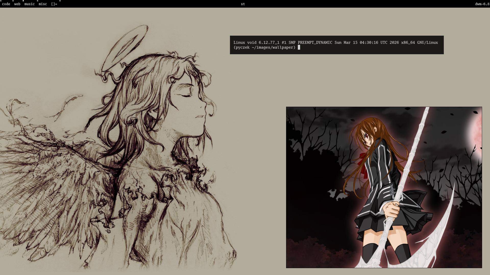
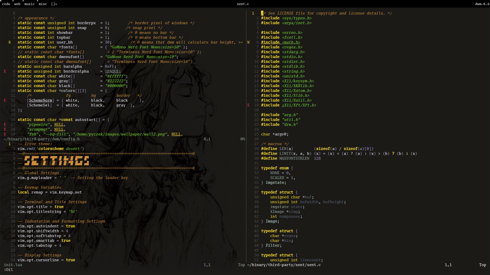
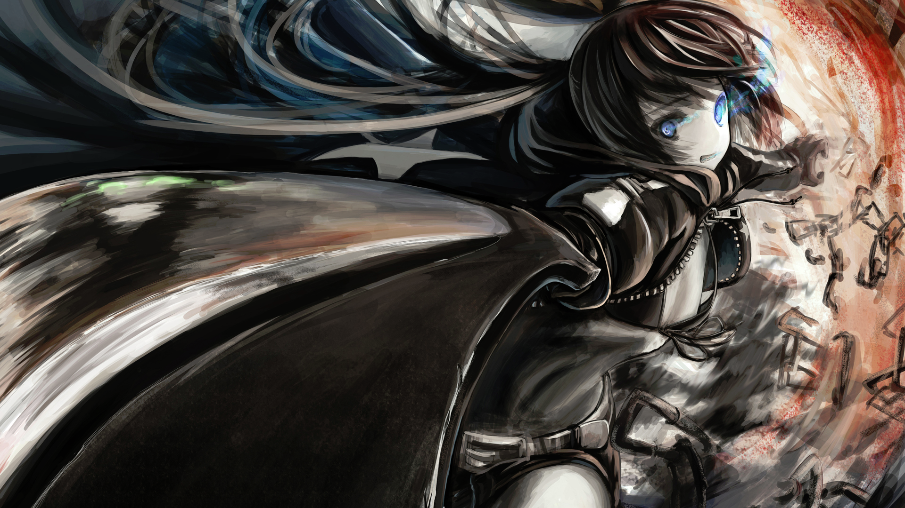

# My configs for
- [dwm](https://dwm.suckless.org/)
- [st](https://st.suckless.org/)
- [dmenu](https://tools.suckless.org/dmenu/)
- [nsxiv](https://github.com/nsxiv/nsxiv)
- [neovim](https://neovim.io/)
---
## it looks like this

---
### my most used wallpapers

---
# I DON'T RECOMMEND USING THIS CONFIG, IT WAS MADE BY ME FOR ME AND IT MAY HAVE SOME WEIRD QUIRKS
